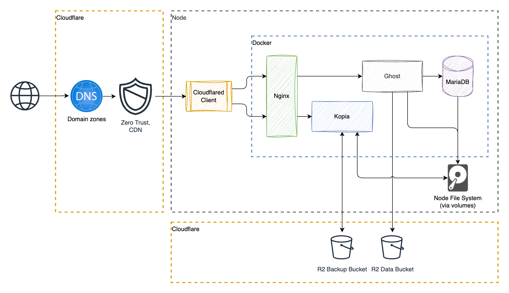

[](http://makeapullrequest.com)
[](https://github.com/robincher/docker-compose-ghost-quickstart/blob/master/LICENSE)


# Introduction 

This is an experimental low-end project to run production grade [Ghost](https://ghost.org/) blog using Docker Compose, maintaining infrastructure with Terraform.

## Key features

1. [Ghost](https://ghost.org/) blog, run in Docker along with MySQL and Nginx.
2. Caching on Nginx level
3. Automatic backups using [Kopia](https://kopia.io/) to S3-like storage
4. Render SSH console in the browser using Cloudflare
5. Access SSH and [Kopia](https://kopia.io/) using IDP like Google or GitHub
6. [CLI](cli.sh) to deploy infrastructure, applications, and access the resources

## Objectives

1. Minimal infrastructure costs, ideally not more than 5$ per month in total
2. Security
3. Performance
4. Low maintenance effort

This all intentionally comes at the cost of reliability risks. However, the chosen stack and tools aim to mitigate this issue.

## Stack

### Development tools

1. Terraform to build and maintain the infrastructure
2. Ansible to perform minimal configuration of the node
3. Docker to run the blog and supporting tools in containers
  
### Cloud providers

1. Hetzner - cloud service provider, offering very democratic prices and decent performance. A special point of interest is Ampere Altra instances (arm64 platform), which are cheaper than usual x86 instances.
2. Cloudlfare - DNS, CDN and DDOS protection, including:
   a.  Zero Trust - reverse proxy and access management
   b.  R2 - S3-like storage for data and backups

# Architecture

[](./Architecture.drawio.png)

## Infrastructure

The infrastructure is built using Terraform. It consists of the following components:
1. Single node in Hetzner Cloud where all the applications are running on Docker (Ghost, MySQL, Nginx, Kopia). The node itself doesn't expose ports and doesn't manage SSL certificates - all the traffic is routed through Cloudflare Zero Trust.
2. Cloudflare Zero Trust platform that proxies external traffic to the node and manages access to the application. It also manages SSL certificates and rendre SSH console in the browser.
3. Cloudflare R2 storage for backups and Ghost data, like images
4. Domain name managed by Cloudflare

## Applications

1. `https://example.com/` - Ghost blog. Proxied by Cloudflare Zero Trust (externally) and Nginx (inside Docker).
2. `https://ssh.example.com/` - SSH console in the browser
3. `https://backup.example.com/` - Kopia backup UI

# Deployment

## Prerequisites

1. [Install Docker and Docker Compose](https://www.docker.com/products/docker-desktop/).
2. Buy a domain name. I would recommend [Porkbun](https://porkbun.com/) for the best market prices and amazing experience. Or check [TLD-LIST](https://tld-list.com/) for other options and prices.
3. Register and setup cloud accounts.
   1. Register [Hetzner Cloud](https://hetzner.cloud/?ref=ZAvXWQkzIrkX) account *(this is a referral link with bonus for you and me)*.
   2. Register [Cloudflare](https://dash.cloudflare.com/sign-up) account and [add a site with you domain name](https://developers.cloudflare.com/fundamentals/setup/account-setup/add-site/).
   3. Register [Mailgun](https://www.mailgun.com/) account and [set up your domain name there](https://help.mailgun.com/hc/en-us/articles/203637190-How-Do-I-Add-or-Delete-a-Domain-). They have a free plan (Flex) that you can find if you go to `Plan & Billing`, press gear icon and select `Unsubscribe`.
   4. You will also need a free [Google Cloud](https://cloud.google.com/?hl=en) and GitHub accounts to setup IDP (detailed instructions are below).
   5. (optionally) Register [GitLab](https://gitlab.com/users/sign_up) account for Docker registry. You can also use GitHub or [canister.io](https://canister.io/), but I personally prefer GitLab.
4. Create copies of [example.com.prod.env](example.com.prod.env) and [example.com.local.env](example.com.local.env) configuration files, and name it exactly as your domain name. Fill in the values in the files (detailed guidance inside). Multiple files for different domains are supported. For example, I host my blog and have files `inshort.dev.prod.env` and `inshort.dev.local.env`

## Deploy

Build CLI so that you don't need to install Terraform, Ansible and Cloudflared locally

```
docker build --tag builder . 
```


Full deployment from scratch (see Operations for details)

```
./cli.sh example.com --new-keys --init-infra --deploy-infra --publish --deploy-app --pull
```

## Post-deployment setup

You need to login `Cloudflare /  R2 / example-com-data / Settings` and **manually** add a custom domain `content.example.com` to the bucket `example-com-data`. This is to access Ghost images uploaded to the bucket without authentication.

It is a consequence of missing Terraform API: https://github.com/cloudflare/terraform-provider-cloudflare/issues/2537

# Operations

Custom CLI to be used deploy and maintain the stack. CLI is build with Docker and contains all the build tools needed for  development: Terraform, Ansible, Cloudflared, etc. You can enter container to use advanced commands:

```
./cli.sh
```

## Deployemnt from scratch

```
./cli.sh example.com \ # Your domain name (and configuration file)
    --new-keys       \ # Generate new SSH keys to access node (run only once)
    --init-infra     \ # Init Terraform (run only once)
    --deploy-infra   \ # Create infrastructure
    --publish        \ # Push Docker images to registry
    --pull           \ # Pull images on the node
    --deploy-app     \ # Run Docker containers on the node
```

Arguments `--new-keys` and `--init-infra` should be run only once. Other arguments are optional and can be run multiple times when updating application or infrastructure.

See [build.sh](build.sh) for command implementation.

## Log in to node via SSH

```
./cli.sh example.com --ssh
```

OR

```
https://ssh.example.com
```

Then you should authenticate with your IDP (Google or GitHub) and select private certificate (located in `~/.ssh/ghost.example.com.id_ed25519` by default).

## Backup (Kopia UI)

```
https://backup.example.com
```

Then you should authenticate with your IDP (Google or GitHub) and enter password (set in `example.com.prod.env`).

There you can setup backup schedule (or run it manually) and restore Ghost content/DB from backup.

## Restore DB from backup

Login to Kopia and restore DB dump to `/data/mysql/backup`. Then run the following command to restore from dump:

```
./cli.sh example.com --restore-db
```

## Destroy everything

```
./cli.sh example.com --destroy-infra

```

# Development

This section is only if you want to develop the project itself. Most likely you don't need it.

## Themes

Put folders or themes archives into [docker/ghost/content.orig/themes](docker/ghost/content.orig/themes) folder. They will be automatically copied  during first initialization.

## Environment setup for development on macOS

```
CLOUDFLARE_SERVICE_TOKEN_ID=...
CLOUDFLARE_SERVICE_TOKEN_SECRET=...

./setup-mac.sh
```

## Run containers locally

```
./local-run.sh example.com
```

# Living example

I run my micro-blog using this stack here: https://inshort.dev/

# Credits
1. To [@robincher](https://github.com/robincher) for the inspiration: https://github.com/robincher/docker-compose-ghost-quickstart
2. To [@laosb](https://github.com/laosb) for his S3 adapter for Ghost: https://github.com/laosb/ghos3